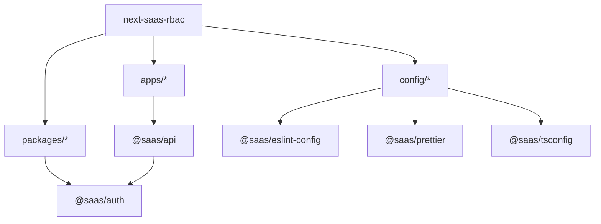

# next-saas-rbac

Monorepo [Turborepo](https://turbo.build/repo) com workspaces npm para um SaaS com controle de acesso baseado em papéis (RBAC). O pacote `@saas/auth` centraliza permissões com [CASL](https://casl.js.org/); a API em `apps/api` consome esse pacote.

**Requisitos:** Node.js `>=18` · npm `11.11.0`

## Pré-requisitos

| Item    | Versão                           |
| ------- | -------------------------------- |
| Node.js | `>=18` (ver `engines` na raiz)   |
| npm     | `11.11.0` (ver `packageManager`) |

Recomenda-se habilitar o [Corepack](https://nodejs.org/api/corepack.html) para usar a versão de npm definida no repositório:

```bash
corepack enable
```

Instale as dependências **sempre na raiz** do monorepo. Dependências entre pacotes internos usam `"*"` (por exemplo, `@saas/auth` em `apps/api`), e não o protocolo `workspace:*`, por compatibilidade com o resolver do npm 11.

## Primeiros passos

```bash
git clone <url-do-repositorio>
cd next-saas-rbac
corepack enable   # opcional
npm install
npm run dev       # inicia os workspaces com task dev (ex.: @saas/api)
```

Para rodar apenas a API:

```bash
npx turbo run dev --filter=@saas/api
```

## Scripts

Comandos disponíveis na raiz ([`package.json`](package.json)):

| Script        | Comando               | Observação                                                        |
| ------------- | --------------------- | ----------------------------------------------------------------- |
| `dev`         | `npm run dev`         | Executa `turbo run dev` nos workspaces que definirem a task `dev` |
| `build`       | `npm run build`       | Executa `turbo run build` nos workspaces que definirem `build`    |
| `lint`        | `npm run lint`        | Executa `turbo run lint` nos workspaces que definirem `lint`      |
| `check-types` | `npm run check-types` | Executa `turbo run check-types` nos workspaces com essa task      |

Para filtrar uma task em um pacote específico:

```bash
npx turbo run build --filter=@saas/api
```

## Estrutura do monorepo



```
.
├── apps/
│   └── api/                 # @saas/api — API Node (tsx)
├── packages/
│   └── auth/                # @saas/auth — RBAC com CASL
├── config/
│   ├── eslint-config/       # @saas/eslint-config
│   ├── prettier/            # @saas/prettier
│   └── typescript-config/   # @saas/tsconfig
├── package.json
└── turbo.json
```

Workspaces npm definidos na raiz: `apps/*`, `packages/*`, `config/*`.

## Aplicações (`apps/`)

### `@saas/api`

API Node em [`apps/api/`](apps/api/). Usa `tsx` em modo watch no script `dev` e depende de `@saas/auth` para checagem de permissões.

```bash
npx turbo run dev --filter=@saas/api
```

## Pacotes (`packages/`)

### `@saas/auth`

Biblioteca de autorização com [CASL](https://casl.js.org/) em [`packages/auth/`](packages/auth/).

- **`defineAbilityFor(user)`** — monta a ability a partir do papel do usuário (`ADMIN` ou `MEMBER`).
- **Papéis e permissões** — definidos em [`permissions.ts`](packages/auth/src/permissions.ts):
  - `ADMIN`: `manage` em `all`
  - `MEMBER`: `invite` em `User`

Ações suportadas: `manage`, `invite`, `delete`. Subjects: `User`, `all`.

Exemplo de uso (como em [`apps/api/src/index.ts`](apps/api/src/index.ts)):

```ts
import { defineAbilityFor } from '@saas/auth';

const ability = defineAbilityFor({ role: 'MEMBER' });

ability.can('invite', 'User');   // true
ability.can('delete', 'User');   // false
```

## Pacotes compartilhados (`config/`)

### `@saas/prettier`

Configuração central do Prettier em [`config/prettier/index.mjs`](config/prettier/index.mjs), com Prettier 3 e `prettier-plugin-tailwindcss`.

A raiz do repositório referencia esse pacote com `"prettier": "@saas/prettier"` no [`package.json`](package.json).

Para verificar a formatação após `npm install`:

```bash
npx prettier --check .
```

### `@saas/eslint-config`

Configurações ESLint compartilhadas em [`config/eslint-config/`](config/eslint-config/). Exports do pacote:

| Export      | Arquivo      | Uso                                                                 |
| ----------- | ------------ | ------------------------------------------------------------------- |
| `next-js`   | `next.js`    | Apps Next.js (base Rocketseat + `eslint-plugin-simple-import-sort`) |
| `node`      | `node.js`    | Pacotes Node (ex.: `@saas/api`)                                     |
| `library`   | `library.js` | Bibliotecas compartilhadas (ex.: `@saas/auth`)                      |

Detalhes de uso em [`config/eslint-config/README.md`](config/eslint-config/README.md).

### `@saas/tsconfig`

Configs TypeScript base em [`config/typescript-config/`](config/typescript-config/):

| Arquivo         | Uso                                      |
| --------------- | ---------------------------------------- |
| `node.json`     | Apps e pacotes Node (ex.: `@saas/api`)   |
| `library.json`  | Bibliotecas compartilhadas (ex.: `@saas/auth`) |

Nos workspaces, estenda com `"extends": "@saas/tsconfig/node.json"` ou `"@saas/tsconfig/library.json"`.

## Turborepo

O arquivo [`turbo.json`](turbo.json) define as tasks:

- **`build`** — depende de `^build` nos pacotes upstream; saída em `.next/**` (exceto cache).
- **`dev`** — persistente, sem cache.
- **`lint`** e **`check-types`** — dependem das mesmas tasks nos pacotes upstream.

## Variáveis de ambiente

Arquivos `.env` e variantes (`.env.local`, etc.) estão no [`.gitignore`](.gitignore) e não devem ser commitados. Quando novas aplicações forem adicionadas em `apps/`, documente as variáveis necessárias no README de cada app.

## Licença

Licença a definir.
